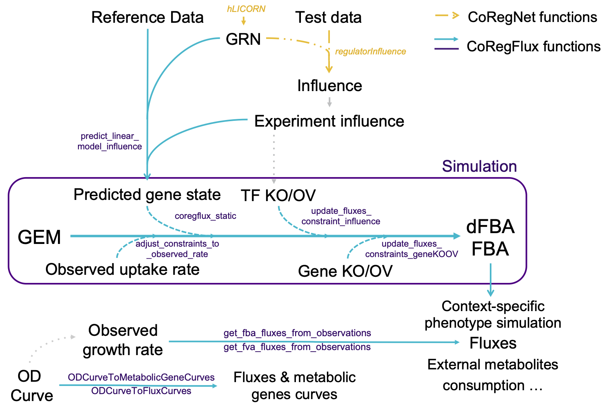

```{r setup, include = FALSE}
knitr::opts_chunk$set(
  collapse = TRUE,
  comment = "#"
)

data("iMM904")
data("SC_GRN_1")
data("SC_EXP_DATA")
data("SC_experiment_influence")
data("SC_Test_data")
data("aliases_SC")
library(CoRegFlux)
library(CoRegNet)
library(sybil)
library(latex2exp)

SYBIL_SETTINGS("SOLVER", "lpSolveAPI", loadPackage = FALSE)

metabolites<-data.frame("names" = c("D-Glucose","Ethanol"),
                        "concentrations" = c(16.6,0))

metabolites_rates<- data.frame("name"=c("D-Glucose"),
                               "concentrations"=c(16.6),
                               "rates"=c(-2.81))

model_uptake_constraints <- adjust_constraints_to_observed_rates(model = iMM904,
                            metabolites_with_rates = metabolites_rates)

Testing_influence_matrix <- CoRegNet::regulatorInfluence(SC_GRN_1,SC_Test_data)
experiment_influence<- Testing_influence_matrix[,1]

PredictedGeneState <- predict_linear_model_influence(network = SC_GRN_1,
                    experiment_influence = experiment_influence,
                    train_expression = SC_EXP_DATA,
                    min_Target = 4,
                    model = iMM904,
                    aliases = aliases_SC)
```
This Vignette accompanies the CoRegFlux package. It can be used either to get some additional information about the methods or to get examples of the use of the functions. Feel free to ask any question to the package maintainer (coregflux at gmail dot com).


# Introduction 

The CoRegFlux package aims at providing tools to integrate reverse engineered gene regulatory networks and gene-expression into metabolic models to improve prediction of phenotypes, both for metabolic engineering, through transcription factor or gene (TF) knock-out or overexpression in various conditions as well as to improve our understanding of the interactions and cell inner-working. 





# Data requirement 

To use *all* CoRegFlux features you will need: 

1. A genome-scale metabolic model for your model organism as a modelOrg object (see sybilSBML for import) 
2. Condition-specific gene expression data / gene states for which the transcription factor influence, a statistical value estimating the TF activity in each sample, will be calculated 
3. A gene regulatory network as a coregnet objet (see the _CoRegNet_ package for more information about network inference) 
4. A large gene expression matrix to train the model


# Quick user guide

## Computing Influence using _CoRegNet_ package function 
```{r,warning = FALSE}
data("SC_GRN_1")
data("SC_EXP_DATA")
data("SC_Test_data")

Testing_influence_matrix <- CoRegNet::regulatorInfluence(SC_GRN_1,SC_Test_data)
experiment_influence<- Testing_influence_matrix[,1]
```

Here are the main functionalities of _CoRegFlux_ 

## 1. Predict gene state/gene expression level from a condition specific experiment using a linear model
```{r, warning= FALSE} 
data("aliases_SC")
PredictedGeneState <- predict_linear_model_influence(network = SC_GRN_1,
                    experiment_influence = experiment_influence,
                    train_expression = SC_EXP_DATA,
                    min_Target = 4,
                    model = iMM904,
                    aliases = aliases_SC)

GeneState<-data.frame("Name" = names(PredictedGeneState),
                     "State" = unname(PredictedGeneState))
```
    
## 2. Simulate dFBA over time (here 20h) without constraint
```{r, warning = FALSE,message = FALSE}

# 16.6 mmol ± =  3g/L Glucose
metabolites<-data.frame("names" = c("D-Glucose","Ethanol"),
                        "concentrations" = c(16.6,0))
# Set your favorite solve in sybil using the command
# SYBIL_SETTINGS("SOLVER", "lpSolveAPI", loadPackage = FALSE)
# See sybil documentation for more information on available solvers

Simulation1<-Simulation(model = iMM904,
                        time = seq(1,20,by = 1),
                        metabolites = metabolites,
                        initial_biomass = 0.45,
                        aliases = aliases_SC)
	
Simulation1$biomass_history
Simulation1$met_concentration_history
```
	
## 3. Simulate a dFBA with gene expression as a constraint

```{r, message = FALSE}
Simulation2<-Simulation(model = iMM904,
	                    time = seq(1,20,by = 1),
                        metabolites = metabolites,
                        initial_biomass = 0.45,
	                    aliases = aliases_SC,
                        gene_state_function = function(a,b){GeneState})
	
Simulation2$biomass_history
Simulation2$met_concentration_history

```
	
## 4. Simulate a dFBA with TF knock-out (KO) while constraining the model with gene expression 

If the simulated mutant have several TFs KO or OV, CoRegFlux will constrain the model according to the order of the TFs in the regulator table.
While this example also constraint the model with gene expression, it is possible to run the simulation without such constraints.

```{r,message = FALSE}
regulator_table <- data.frame("regulator" = "MET32",
                              "influence" =  -1.20322,
                              "expression" = 0,
                              stringsAsFactors = FALSE)

SimulationTFKO<-Simulation(model = iMM904,
	                    time = seq(1,20,by = 1),
                        metabolites = metabolites,
                        initial_biomass = 0.45,
	                    aliases = aliases_SC,
                        coregnet = SC_GRN_1,
                        regulator_table = regulator_table ,
                        gene_state_function = function(a,b){GeneState})

SimulationTFKO$biomass_history ## This KO is predicted as non-lethal 
```

## 5. Simulate a dFBA with TF over-expression (OV) while constraining the model
with gene expression 

If the simulated mutant have several TFs KO or OV, CoRegFlux will constrain the model according to the order of the TFs in the regulator table.
While this example also constraint the model with gene expression, it is possible to run the simulation without such constraints.


```{r,message =FALSE}
regulator_table <- data.frame("regulator" = "MET32",
                                  "influence" = -1.20322 ,
                                  "expression" = 3,
                                  stringsAsFactors = FALSE)

SimulationTFOV<-Simulation(model = iMM904,
		                    time = seq(1,20,by = 1),
                            metabolites = metabolites,
                            initial_biomass = 0.45,
		                    aliases = aliases_SC,
                            coregnet = SC_GRN_1,
                            regulator_table = regulator_table,
                            gene_state_function = function(a,b){GeneState})

SimulationTFOV$biomass_history ## This OV is predicted as non-lethal
```

## 6. Simulate a dFBA with gene(s) knock-out or over-expression simulation while constraining the model with gene expression

If the simulated mutant have several gene KO or gene OV, CoRegFlux will constrain the model according to the order of the genes in the gene table.
While this example also constraint the model with gene expression, it is possible to run the simulation without such constraints.


```{r,message =FALSE}
gene_table <- data.frame("gene" = c("YJL026W","YIL162W"),
                                  "expression" =c(2,0),
                                  stringsAsFactors = FALSE)

SimulationGeneKO_OV<-Simulation(model = iMM904,
                                time = seq(1,20,by = 1),
                                metabolites = metabolites,
                                initial_biomass = 0.45,
		                        aliases = aliases_SC,
                                coregnet = SC_GRN_1,
                                gene_table = gene_table,
                                gene_state_function = function(a,b){GeneState})

SimulationGeneKO_OV$biomass_history ## This OV is predicted as non-lethal
```

## 7. Constrain the model according to gene expression, TF KO or OV, gene KO or OV to run various FBA using sybil 

The different functions used by CoRegFlux to constraint the model are individually accessible to allow the combination of CoRegFlux's models with other algorithms and parameters, provided by sybil for instance. A model can be constrain iteratively through the different function. In that case, the recommended order is as follows: uptake constraint, gene expression, TF KO or OV, gene KO or OV.

```{r,eval=FALSE,message =FALSE,warnings=FALSE}

metabolites_rates <- data.frame("name"=c("D-Glucose"),
                               "concentrations"=c(16.6),
                               "rates"=c(-2.81))

model_uptake_constraints <- adjust_constraints_to_observed_rates(model = iMM904, 
                                    metabolites_with_rates = metabolites_rates)

model_gene_constraints <- coregflux_static(model= iMM904,
                                           predicted_gene_expression = 
                                               PredictedGeneState,
                                           aliases = aliases_SC)$model

model_TF_KO_OV_constraints <- update_fluxes_constraints_influence(model= iMM904,
                                           coregnet = SC_GRN_1,
                                           regulator_table = regulator_table,
                                           aliases = aliases_SC )

model_gene_KO_OV_constraints <- update_fluxes_constraints_geneKOOV(
                                            model= iMM904,
                                            gene_table =  gene_table,
                                            aliases = aliases_SC)

sol <- sybil::optimizeProb(model_TF_KO_OV_constraints)                                              
```

## 8. Adjusting the fluxes bounds based on observed growth rates, and visualized its effects on metabolic genes 

	
```{r, message = FALSE, warnings = FALSE}

FBA_bounds_from_growthrate<- get_fba_fluxes_from_observations(
    model = iMM904,observed_growth_rate = 0.3,
    metabolites_rates = metabolites_rates)

FVA_bounds_from_growthrate<- get_fva_intervals_from_observations(
    model = iMM904,observed_growth_rate = 0.3,
    metabolites_rates = metabolites_rates)
```

```{r, message= FALSE, warning=FALSE}
ODs<-seq.int(0.099,1.8,length.out = 5)
times = seq(0.5,2,by=0.5)

ODcurveToMetCurve<- ODCurveToMetabolicGeneCurves(times = times,
                             ODs = ODs,
                             model = iMM904,
                             aliases = aliases_SC,
                             metabolites_rates = metabolites_rates) 

visMetabolicGeneCurves(ODcurveToMetCurve,genes = "YJR077C")

ODtoflux<-ODCurveToFluxCurves(model = iMM904,
                              ODs = ODs,
                              times = times,
                              metabolites_rates = metabolites_rates)

visFluxCurves(ODtoflux, genes ="ADK3")
```

# Simulations, constraints and calibration 

## Simulations

For each simulation step, the function receives a metabolic model and performs:
  
  - update fluxes by metabolites concentrations
  
  - update fluxes by coregnet and influence value
  
  - update fluxes by gene state from the GRN simulator


The simulation result is a list containing:
  
  - objective_history: time series of objective function value for the linear program 
  
  - metabolites: metabolites concentrations over time
  
  - fluxes_history: time series of the fluxes values for all the time series
  
  - metabolites_concentration_history: time series of metabolite concentrations 
  
  - metabolites_fluxes_history: time series of the metabolites fluxes during  the simulation
  
  - rate_history: time series of the growth rate values for all simulation
  
  - time: vector containing the simulation times
  
  - gene_state_history: list containing the values for the gene state during the simulation
  
  
The fluxes for the simulation time are stored in a matrix which row names are the fluxes reaction id.


```{r}
Simulation1$fluxes_history[1:10,1:9]
```

To have access to the gprRules users can use the sybil package, which returns a vector of size equal to the number of fluxes and the associated genes.

```{r}
gpr(iMM904)[1:5]
```

If you only wish to know which gene affects which reaction; the sybil objects have a slot for obtaining the flux-gene matrix. 

```{r}
iMM904@rxnGeneMat[1:10,1:10]
```

## Constraining the model

When provided with different kind of constraints, CoRegFlux process the given information in the following order: 

- Gene expression is first integrated
- TF KO or OV is carried out, starting with the first line in the regulator table and going along the rows.
- Gene KO or OV is carried out. starting with the first line in the gene table and going along the rows.
Thus order in the regulator table and gene table might play a role and potentially give different results.

The different functions used by CoRegFlux to constraint the model are individually accessible to allow the combination of CoRegFlux's models with other algorithms and parameters, provided by sybil for instance.  A model can be constrain iteratively through the different function. In that case, the recommended order is as follows: uptake constraint, gene expression, TF KO or OV, gene KO or OV.

```{r}

regulator_table <- data.frame("regulator" = c("MET32","CAT8"),
                              "influence" =  c(-1.20322,-2.4),
                              "expression" = c(0,0),
                              stringsAsFactors = FALSE)

model_TF_KO_OV_constraints <- update_fluxes_constraints_influence(model= iMM904,
                                           coregnet = SC_GRN_1,
                                           regulator_table = regulator_table,
                                           aliases = aliases_SC )

sol<-sybil::optimizeProb(model_TF_KO_OV_constraints) 
#Additional parameters from sybil can then be integrated such as the chosen 
# algorithms

sol
```

## From observations to fluxes

Here we will compute the fluxes from the observed growth rates (which can be obtained directly from the growth curves)

Assuming we have an observed growth rate of 0.3
```{r}
fluxes_obs <- 
  get_fba_fluxes_from_observations(iMM904,0.3)
fluxes_obs[1:10,]
```

Given that the fba solution is not unique, if you wish to see the intervals of maximum and minimum allowed fluxes for a reaction, flux variability analysis should be used

```{r}
fluxes_intervals_obs <-
  get_fva_intervals_from_observations(iMM904,0.3) 
fluxes_intervals_obs[1:10,]
```


It worth noting that none of the two methods guarantee that the observed growth rate will be reached.

```{r}
fluxes_obs[get_biomass_flux_position(iMM904),]
fluxes_intervals_obs[get_biomass_flux_position(iMM904),]
```

This could mean that the uptake rates for the limiting substrates (most commonly glucose uptake rate) does not allow for higher growth.

To constraint the model using the substrate uptake rate, the user must also provide the metabolites_rates argument

```{r, result="hide"}
metabolites_rates <- data.frame("name"=c("D-Glucose","Ethanol"),
                               "rates"=c(-10,-1))
fluxes_obs <- 
  get_fba_fluxes_from_observations(
    model = iMM904,
    observed_growth_rate =  0.3,
    metabolites_rates = metabolites_rates) 

fluxes_obs[get_biomass_flux_position(iMM904),]

fluxes_interval_obs <- 
  get_fva_intervals_from_observations(
    model = iMM904,
    observed_growth_rate =0.3,
    metabolites_rates = metabolites_rates) 
fluxes_interval_obs[get_biomass_flux_position(iMM904),]

```

## Calibration: identifying the softplus parameter using bayesian optimization

To translate the gene expression to fluxes in the GEM, CoRegFlux use the softplus function 

```{r,echo=FALSE,warning=FALSE,tidy=TRUE}
library(ggplot2)
library(latex2exp)
eq_title<-latex2exp::TeX('$v_{i}\\leq\\ln\\left(1+ \\exp\\left(\\theta+gpr_{i}\\left(X\\right)\\right)\\right)$')
fun_1 <- function(x)log(1+exp(x))

p <- ggplot2::ggplot(data = data.frame(x = 0), mapping = ggplot2::aes(x = x))
p + ggplot2::stat_function(fun = fun_1,colour="red") + ggplot2::xlim(-5,5)  + 
    ggplot2::geom_vline(xintercept = 0) + ggplot2::geom_hline(yintercept = 0) + ggplot2::ggtitle(eq_title)
```

where $\theta$ is the softplus parameter applied to all fluxes, $gpr_{i}\left(X\right)$ is the result of evaluating the gene-protein-reaction rules for a set of gene expression levels of the metabolic genes $X$. These rules relate genes to reactions and are logical form. CoRegflux transform these rules as follows 
 
 - AND are substitued by MIN()
 - OR are substituted by SUM().
 
Given a known growth rate and predicted gene expressions obtained through the function predict_linear_model_influence, the users have the possibility to adjust the softplus parameter $\theta$ to calibrate the integration of the gene expression in the GEM. This step requires the installation of the package rBayesianOptimization.

```{r, message =FALSE,eval=FALSE}
library(rBayesianOptimization)
gRates <- 0.1

opF<-function(p){
        CoRegFlux_model<-coregflux_static(model = model_uptake_constraints,
                                          gene_parameter = p,
                                          predicted_gene_expression = 
                                              PredictedGeneState)
        ts<-optimizeProb(CoRegFlux_model$model)
        list(Score=-1*log(abs(ts@lp_obj-gRates)/gRates),Pred=0)
    }

result<-BayesianOptimization(FUN = opF,
                             bounds = list(p = c(10,10)),
                             data.frame(p = seq(10,10,by =  0.5)),
                             n_iter = 10, 
                             verbose = TRUE)

```
	
